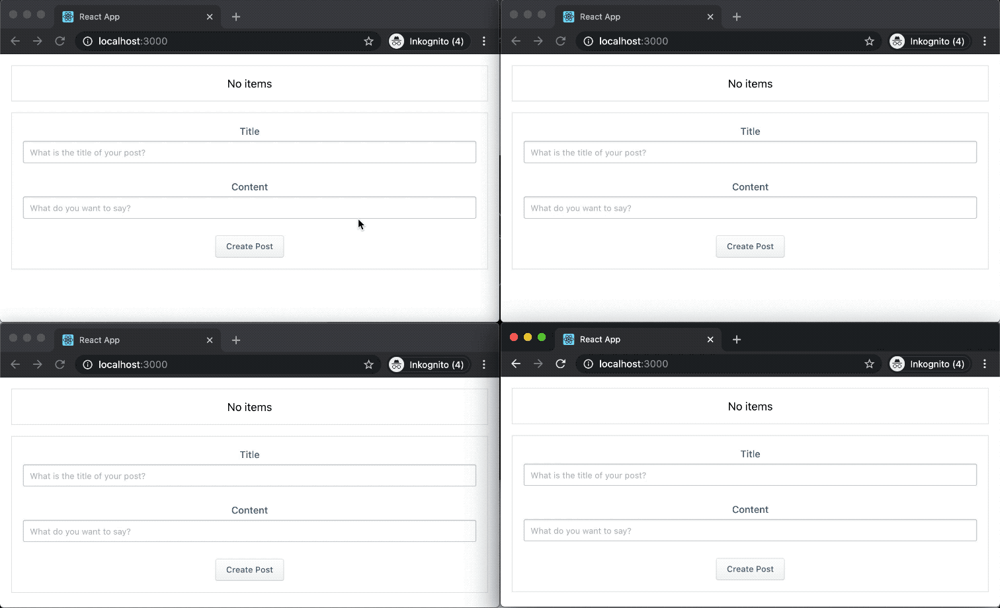

# Streaming web content with a log-based architecture with Amazon MSK

The repository contains the sample code for the [article](https://aws.amazon.com/blogs/big-data/streaming-web-content-with-a-log-based-architecture-with-amazon-msk/)

## Introduction



The repository contains the example of a [microblogging](https://en.wikipedia.org/wiki/Microblogging) service that uses a log-based architecture on [Amazon MSK](https://aws.amazon.com/msk/). It consists of a [React](https://reactjs.org/) app that allows you to publish and read articles. A service which implements the [gRPC](https://grpc.io/) service to publish and subscribe to the messages (articles) that are created. And the [AWS CloudFormation](https://aws.amazon.com/cloudformation/) templates to run the service on the AWS cloud. The client uses [gRPC for Web Clients](https://github.com/grpc/grpc-web) to communicate with the pub/sub service.

## Technologies

- [Protobuf](https://developers.google.com/protocol-buffers) protocol for the service
- [React](https://reactjs.org/) app with [gRPC for Web Clients](https://github.com/grpc/grpc-web)
- [gRPC](https://grpc.io) service to subscribe and publish articles
- [AWS CloudFormation](https://aws.amazon.com/cloudformation/) templates to run the service

## Architecture

The architecture for the service is provisioned by two [CloudFormation](https://aws.amazon.com/cloudformation/) stacks. A core stack that contains naive AWS components like VPC, NAT Gateway and Amazon MSK. And a second app stack, which provisions the app on [Fargate](https://aws.amazon.com/fargate/) with an [Application Load Balancer](https://docs.aws.amazon.com/elasticloadbalancing/latest/application/introduction.html)


---

## Running the example

You can either run the example on

- [AWS Cloud9](#run-on-aws-cloud9)
- [Your machine](#run-on-your-machine).

> We recommend using [AWS Cloud9](https://aws.amazon.com/cloud9/) to discover the example.

---

## Run on AWS Cloud9

First, you need your own AWS account. Follow these [steps](https://aws.amazon.com/premiumsupport/knowledge-center/create-and-activate-aws-account/) if you do not have an account.

> :warning: Running the application will create and consume AWS resources. This will cost you money. Make sure you shut down/remove all resources once you are finished to avoid ongoing charges to your AWS account.

### Create a Workspace

> :warning: The [AWS Cloud9](https://aws.amazon.com/cloud9/) workspace should be created by an IAM user with Administrator privileges, not the root account user. Please ensure that you are logged in as an IAM user, not the root account user.

- [Open AWS Cloud9 in the AWS Console](https://console.aws.amazon.com/cloud9/home).
- Select **Create environment** to create a new workspace
- Name it **mskworkshop**, click _Next step_.
- Choose **"t3.small"** as _Instance Type_, take all default values and click _Next Step_
- On the overview double check your inputs and click _Create Environment_

> :boom: AWS Cloud9 provides a default auto-hibernation setting of 30 minutes for your Amazon EC2 instances created through Cloud9. With this setting, your EC2 instances automatically stop 30 minutes after you close the IDE and restart only when you reopen the IDE.

- When your workspace is ready, customize the environment by closing the _Welcome_ tab, and opening up a new tab in the workspace.


- Your workspace should look like this now.


> :boom: If you prefer a different theme, you can choose one by selecting _View > Themes > Solarized > Solarized Dark_

### Update to the latest AWS CLI

- Run the following command to view the current version of the [AWS CLI](https://aws.amazon.com/cli/).

```bash
aws --version
```

- Update to the latest version.

```bash
pip install --user --upgrade awscli
```

- Confirm that you have a newer version running.

```bash
aws --version
```

### Install tools

The workshop needs some tools to be installed in the environment.

```bash
sudo yum install -y jq
```

This will install Node.js in your Cloud9 environment.

```bash
curl -o- https://raw.githubusercontent.com/nvm-sh/nvm/v0.34.0/install.sh | bash
```

Active the environment.

```bash
. ~/.nvm/nvm.sh
```

Use `nvm` to install a current version of Node.js.

```bash
nvm install node
```

Later we will use the [yarn](https://yarnpkg.com/) package manager for installing the client packages.

```bash
npm install yarn -g
```

> :warning: There is an extensive [tutorial](https://docs.aws.amazon.com/sdk-for-javascript/v2/developer-guide/setting-up-node-on-ec2-instance.html) that walks through the steps of setting up Node.js on an Amazon EC2 instance.

### Clone the workshop

You will need to clone the workshop to your [AWS Cloud9](https://aws.amazon.com/cloud9/) workspace.

```bash
# First, be sure you are in your environment directory
cd ~/environment
```

Clone the respository to your environment directory and change into the directory

```bash
git clone https://github.com/aws-samples/aws-msk-content-streaming aws-msk-content-streaming && cd $_
```

### Resize the environment

By default Cloud9 has 8GB storage attached. To build the containers you need more space.

```bash
make resize
```

This will resize your environment to 20GB storage.

> If encounter an error that the `/dev/nvme0n1` device does not exists, then this means you are not running on a Nitro-based architecture. Please replace the devices as explained [here](https://docs.aws.amazon.com/cloud9/latest/user-guide/move-environment.html) with the right ones.

### Create an SSH Key

Please run this command to generate SSH Key in Cloud9. This key will be used on the worker node instances to allow ssh access if necessary.

```bash
ssh-keygen
```

> :warning: Press `enter` 3 times to take the default choices

Upload the public key to your EC2 region.

```bash
aws ec2 import-key-pair --key-name ${C9_PROJECT} --public-key-material file://~/.ssh/id_rsa.pub
```

If you got an error similar to `An error occurred (InvalidKey.Format) when calling the ImportKeyPair operation: Key is not in valid OpenSSH public key format` then you can try this command instead.

```bash
aws ec2 import-key-pair --key-name ${C9_PROJECT} --public-key-material fileb://~/.ssh/id_rsa.pub
```

Set the environment variable for the `KEY_PAIR`.

```bash
export KEY_PAIR=${C9_PROJECT}
```

### Deploy the workshop

Running the script will deploy the application.

```bash
make deploy
```

> This can take a while, as you will create a high available Kafka with Amazon MSK.

> :warning: The deploy scripts detect when you are running the deploy in a [AWS Cloud9](https://aws.amazon.com/cloud9/) workspace. It sets the `PROJECT_NAME` to your Cloud9 environment name, and extracts the `AWS_ACCOUNT_ID` and `AWS_DEFAULT_REGION`. You can override any of these variables

When the process is finished, you can start the React app. It will start the application with the `REACT_APP_ENDPOINT` environment variable which is set to the URL of the provisioned Application Load Balancer.

```bash
make start
```

When the application is finished to be installed you will see a message that it `Compiled successfully!`. You can access the preview by selecting _Preview > Preview Running Runnin Application_ from the toolbar. This will open a new tab with the application.

:warning: you cannot post new content yet. Because we do not have a custom domain, we have not enabled HTTPS with our service. You will have to access the preview URL with HTTP.

Either copy the full url (e.g. `https://12345678910.vfs.cloud9.eu-west-1.amazonaws.com/`) and replace `https` with `http`. Or click on the _Pop Out Into New Window_ button next to the browser bar and then replace it.


You can now test it by creating an new item. Give it a title and add some content. If you have finished click _Create Post_.

> You can access the app at [localhost:3000](http://localhost:3000) if you run the example on your local machine.

### Cleanup

The last step is to cleanup your account. This will delete all created resources.

```bash
make delete
```

## Run on your machine

You can either run the example on your own machine, or [run on AWS Cloud9](#run-on-aws-cloud9). If you run it on your own machine you will have to install some additional tools.

- [Docker](https://docs.docker.com/install/)
- [AWS Command Line Interface](https://aws.amazon.com/cli/)
- [Node.js](https://nodejs.org/en/) and [Yarn Package Manager](https://yarnpkg.com/)
- Linux userland with bash
- [GNU Make](https://www.gnu.org/software/make/)

You will have to clone the repository

```bash
git clone https://github.com/aws-samples/aws-msk-content-streaming aws-msk-content-streaming && cd $_
```

and manually set the environment variables for the project.

```bash
export PROJECT_NAME=<YOUR_PROJECT_NAME>
export AWS_ACCOUNT_ID=<YOUR_ACCOUNT_ID>
export AWS_DEFAULT_REGION=<YOUR_AWS_REGION>
```

You can then deploy the CloudFormation Stacks via.

```bash
make deploy
```

Start the development server at [localhost:3000](http://localhost:3000) if you run the example on your local machine.

```bash
make start
```

And jump to the [cleanup](#cleanup) if you have finished playing around with the example.

## License

[MIT](/LICENSE)
