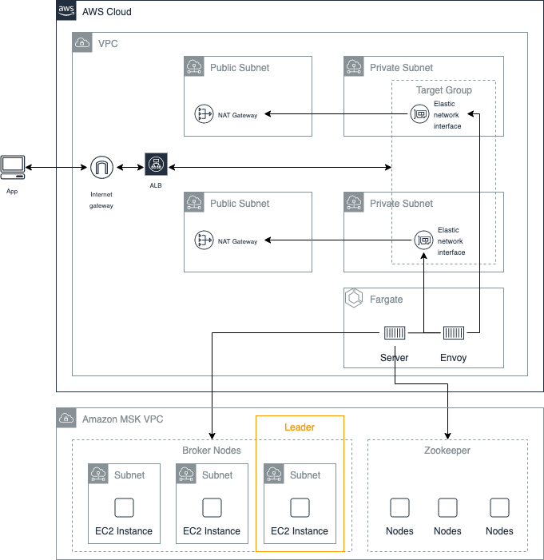

# How to Stream Content on the Web with Log-Based Architectures on Amazon MSK

The repository contains the sample code for the article.

## Introduction

The article explains the virtues of log-based architectures and how they can help to build scalable web and mobile applications. [Amazon MSK](https://aws.amazon.com/msk/) is a managed [Apache Kafka](https://kafka.apache.org/). It is based on a commit log and helps you to build log-based architectures.

The repository contains the example of a [microblogging](https://en.wikipedia.org/wiki/Microblogging) service that uses a log-based architecture on [Amazon MSK](https://aws.amazon.com/msk/). It consists of a [React](https://reactjs.org/) app that allows you to publish and read articles. A service which implements the [gRPC](https://grpc.io/) service to publish and subscribe to the messages (articles) that are created. And the [AWS CloudFormation](https://aws.amazon.com/cloudformation/) templates to run the service on the AWS cloud. The client uses [gRPC for Web Clients](https://github.com/grpc/grpc-web) to communicate with the pub/sub service.

## Technologies

- [Protobuf](https://developers.google.com/protocol-buffers) protocol for the service
- [React](https://reactjs.org/) app with [gRPC for Web Clients](https://github.com/grpc/grpc-web)
- [gRPC](https://grpc.io) service to subscribe and publish articles
- [AWS CloudFormation](https://aws.amazon.com/cloudformation/) templates to run the service

## Architecture

The architecture for the service is provisioned by two [CloudFormation](https://aws.amazon.com/cloudformation/) stacks. A core stack that contains naive AWS components like VPC, NAT Gateway and Amazon MSK. And a second app stack, which provisions the app on [Fargate](https://aws.amazon.com/fargate/) with an [Application Load Balancer](https://docs.aws.amazon.com/elasticloadbalancing/latest/application/introduction.html)



## Prerequisites

Running the microblogging service that the articles uses to exemplify content streaming on the web with [Amazon MSK](https://aws.amazon.com/msk/) has prerequisites. You need to [create and activate a AWS account](https://aws.amazon.com/premiumsupport/knowledge-center/create-and-activate-aws-account/), if you do not already have one. Furthermore, you need a machine with the required tools installed. The required tools to run it are the following.

- [Docker](https://docs.docker.com/install/)
- [AWS Command Line Interface](https://aws.amazon.com/cli/)
- [Node.js](https://nodejs.org/en/) and [Yarn Package Manager](https://yarnpkg.com/)
- Linux userland with bash
- [GNU Make](https://www.gnu.org/software/make/)

---

## Get Started

> :warning: Running the application will create and consume AWS resources. This will cost you money. Make sure you shut down/remove all resources once you are finished to avoid ongoing charges to your AWS account.

### Create a Workspace

:warning: The [AWS Cloud9](https://aws.amazon.com/cloud9/) workspace should be created by an IAM user with Administrator privileges, not the root account user. Please ensure that you are logged in as an IAM user, not the root account user.

- [Open AWS Cloud9 in the AWS Console](https://console.aws.amazon.com/cloud9/home).
- Select **Create environment** to create a new workspace
- Name it **mskworkshop**, click _Next step_.
- Choose **"t3.small"** as _Instance Type_, take all default values and click _Next Step_
- On the overview double check your inputs and click _Create Environment_

> :boom: AWS Cloud9 provides a default auto-hibernation setting of 30 minutes for your Amazon EC2 instances created through Cloud9. With this setting, your EC2 instances automatically stop 30 minutes after you close the IDE and restart only when you reopen the IDE.

- When your workspace is ready, customize the environment by closing the _Welcome_ tab, and opening up a new tab in the workspace.


- Your workspace should look like this now.


> :boom: If you prefer a different theme, you can choose one by selecting _View > Themes > Solarized > Solarized Dark_

First, you need your own AWS account. Follow these [steps](https://aws.amazon.com/premiumsupport/knowledge-center/create-and-activate-aws-account/) if you do not have an account.

Next, you have to setup the environment for the `deploy.sh` script. You use the script to deploy and destroy the application.

### Update to the latest AWS CLI

- Run the following command to view the current version of the [AWS CLI](https://aws.amazon.com/cli/).

```bash
aws --version
```

- Update to the latest version.

```bash
pip install --user --upgrade awscli
```

- Confirm that you have a newer version running.

```bash
aws --version
```

### Install tools

The workshop needs some tools to be installed in the environment.

```bash
sudo yum install -y jq
```

### Clone the workshop

You will need to clone the workshop to your [AWS Cloud9](https://aws.amazon.com/cloud9/) workspace.

```bash
# First, be sure you are in your environment directory
cd ~/environment
```

Clone the respository to your environment directory and change into the directory

```bash
git clone https://github.com/aws-samples/aws-msk-content-streaming aws-msk-content-streaming && cd $_
```

### Deploy the workshop

Running the script will deploy the application.

```bash
make deploy
```

> This can take a while, as you will create a high available Kafka with Amazon MSK.

> :warning: The deploy scripts detect when you are running the deploy in a [AWS Cloud9](https://aws.amazon.com/cloud9/) workspace. It sets the `PROJECT_NAME` to your Cloud9 environment name, and extracts the `AWS_ACCOUNT_ID` and `AWS_DEFAULT_REGION`. You can override any of these variables

When the process is finished, you can start the React app. It will start the application with the `REACT_APP_ENDPOINT` environment variable which is set to the URL of the provisioned Application Load Balancer.

```bash
make start
```

You can access the app at [localhost:3000](http://localhost:3000) if a new browser windows has not been opened by the developement server.

## License

[MIT](/LICENSE)
